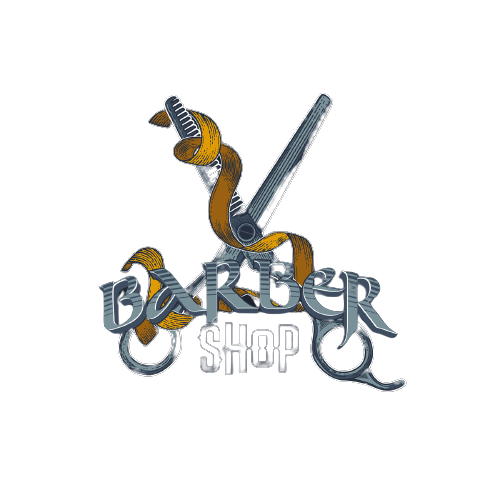

<h1 style="text-align: center; font-family: heveltica; font-size: 45px"> Projeto - Barbearia Web </h1>

  (projeto na fase de planejamento)
 
 ## Aqui temos meu primeiro projeto de um programa web para adiministração e controle de horários da sua barbearia, onde o acesso de clientes será possivel marcar/desmarcar horários, escolher os tipos de cortes e saber os valores dos cortes, e hávera um acesso ao proprietário especial para relatorios e acesso aos horarios.

  *  **Linguagens Trabalhadas**   

     1. ### JavaScript ;
     2. ### HTML ;
     3. ### CSS ;
     4. ### SQL ; 

  *  **Funcionalidades para Clientes** 

    1. ### Marcação de horários ;
    2. ### Acesso a valores dos cortes ;
    3. ### Acesso a tipos de corte  ;

*  **Funcionalidades para Proprietário** 

    1. ### Relatorios gerais sobre:
        * #### Médias e números de cortes por dia / mês / ano ( Geral e por Cliente ) ;
        * #### Pequeno controle de caixa para saber os ganhos por dia / mês / ano ;
        * #### Dias mais movimentados da semana ;
        * #### Controle sobre número de clientes, podendo deletar ou modificar cadastros ;

*  **Funcionalidades Gerais** 
    
    1. ### Cadastro de Clientes e Conta-Gerente administrativa ;
    2. ### Funcionalidades de geração de relatorios ;
    3. ### Formulários para marcação de horários e avisos sobre horarios disponíveis / indisponíveis ;

  

## Esse projeto visa aplicar tudo que venho aprendendo em minha caminhada de aprendizagem sobre programção web, mas de forma básica. O programa não tem o intuito de ser utilizado comercialmente ;
